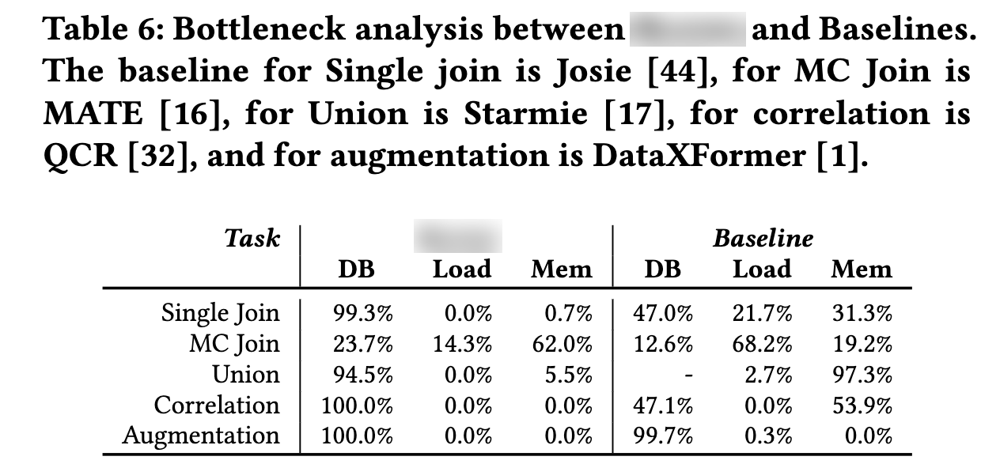

# Blend: A Unified Data Discovery System
Here you can find the code for the "Blend: A Unified Data Discovery System" paper.
## Abstract
Data discovery is an iterative and incremental process that necessitates the execution of multiple data discovery queries to identify the desired tables from large and diverse data lakes. Current methodologies concentrate on single discovery tasks such as join, correlation, or union discovery. However, in practice, a series of these approaches and their corresponding index structures are necessary to enable the user to discover the desired tables.

This paper presents Blend, a comprehensive data discovery system that empowers users to develop ad-hoc discovery tasks without the need to develop new algorithms or build a new index structure. To achieve this goal, we introduce a general index structure capable of addressing multiple discovery queries. We develop a set of lower-level operators that serve as the fundamental building blocks for more complex and sophisticated user tasks. These operators are highly efficient and enable end-to-end efficiency. 

To enhance the execution of the discovery pipeline, we rewrite the search queries into optimized SQL statements to push the data operators down to the database. We demonstrate that our holistic system is able to achieve comparable effectiveness and runtime efficiency to the individual state-of-the-art approaches specifically designed for a single task.


## Installation
The code was tested on Python 3.10.9. To install the required packages run the following command: 
```bash
python -m pip install -r requirements.txt
```

## Index generation
To build the index you can use the `create_index.py` file. Before executing it you must change the required parameters in the file.

```python
PATH = 'data/*.csv' # The path where the csv files are located
INDEX_NAME = 'blend_index' # The name of the created index for Blend

dbcon = vertica_python.connect(
        port=5433,
        host='db.example.com',
        user='username',
        password='password',
        database='vdb',
        session_label='some_label',
        read_timeout=60000,
        unicode_error='strict',
        ssl=False,
        use_prepared_statements=False
)
```

## Example
Underneath you can find the examples of the plans used in the paper.

### Union plan
```python
def UnionPlan(dataset, k=10):
    plan = Plan()
    input_element = Input(dataset)
    plan.add('input', input_element)
    for clm_name in dataset.columns:
        element = Seekers.SC(dataset[clm_name], k)
        plan.add(clm_name, element, ['input'])
    plan.add('counter', Combiners.Counter(K), dataset.columns)
    plan.add('terminal', Terminal(), ['counter'])
```


### Augumentation by example plan
```python
def AugmentationByExamplePlan(examples, queries, K=10):
    plan = Plan()
    inputs = Input([examples, queries])
    plan.add('input', inputs)
    examples_seeker = Seekers.MC([inputs.examples], K)
    plan.add('example', examples_seeker, ['input'])
    query_seeker = Seekers.SC(inputs.queries, K)
    plan.add('query', query_seeker, ['input'])
    plan.add('combiner', Combiners.Intersection(K), ['example', 'query'])
    plan.add('terminal', Terminal(), ['combiner'])
df = pd.read_csv('dataset.csv')
aug = CreateAugmentationPlan(df[['E1', 'E2']], df['Q'])
aug.run()
```

## Additional experiments




In this section, we assess the runtime distribution for each of the
evaluated operations. We divide the execution of each search plan
into three computational components, namely, DB, which represents the amount of time spent on database query execution, Load,
which shows how much time it takes to load the database query results into the main memory, and Mem, representing the time spend
for processing the data in the main memory. Our goal in Blend
is to reduce the loading time by moving most of the computation
into the database to prevent expensive data movement. By doing
so, we can achieve a runtime efficiency that is comparable to the
stand-alone state-of-the-art baselines. Table 5 shows the results
of this experiment. As the union discovery baseline, i.e., Starmie,
leverages a large language model, this baseline does not use any
database to store the table values. In this case, the loading time
represents the average time the approach takes to generate the
embeddings from the large language model for the query tables.
In all discovery tasks except the union discovery, where DB is
not defined for baseline, Blend consumes a higher percentage
of the time during in-database query execution compared to the
baselines. On average Blend utilizes the database up to 45% more
than the baselines. This results in a drastic reduction of the loading
time. Blend’s loading time is negligible in all cases except in the
MC join discovery. Blend requires more time to load the data for
MC join because, to efficiently prune of the false positives, Blend
requires to read the posting list, including the super keys. These
posting lists, depending on the number of candidate tables, require
additional fetching time. However, the SQL query used in Blend
reduces the number of candidate tables, therefore, it reduces the
loading overhead from 68.2% in MATE to 14.3%.
