# User Study
We conducted a survey and obtained results from 18 participants (40% response rate) covering diverse sectors, such as health care, banking, technology, and universities. We aimed to understand preferences, needs, and challenges in data discovery and let participants choose between different implementations of simple and complex pipelines.

The questionaire was divided into three sections:
1. Background information on the participants
2. Questions on data discovery preferences and needs
3. Implementation preferences for simple and complex tasks

Below we present the individual questions and results of the survey.

## Section 1: Background Information
In order to gain insight into the participants' backgrounds and the potential influence of their roles and industries on their preferences and needs in data discovery, we asked them about their area of work and roles within their organizations.

### Question 1: What type of industry (education, finance, automotive, ...) do you belong to?
#### Results (from free text input)
| Answer                     | Count | Area of Work  |
|----------------------------|-------|---------------|
| Academia, applied projects | 1     | Research      |
| Education                  | 6     | Research      |
| Research                   | 2     | Research      |
| Automotive                 | 2     | Industry      |
| Finance                    | 3     | Industry      |
| Finance and business       | 1     | Industry      |
| Healthcare                 | 1     | Industry      |
| IoT                        | 1     | Industry      |
| Software industry          | 1     | Industry      |

Based on their answers we have grouped the 18 participants into two affiliations: Research indicates those involved in academia, and Industry are individuals employed in companies.

### Question 2: What is your role in the organization?
#### Results (from free text input)
| Research | Industry |
|----------|----------|
| Senior Researcher | Head of Cloud Development |
| Research Associate | Software Developer |
| Research Associate | Developer |
| Researcher | Developer |
| Researcher | Data Scientist |
| Professor | Master Student |
| PhD Student | Data Science Trainee |
| PhD Student | Senior ML Engineer |
| PhD Student | Software Engineer |
| Research Assistant | Senior Engineer |

The Research group includes roles such as Senior Researcher, Research Associate, Researcher, Professor, PhD Student, and Research Assistant.

The Industry group includes roles such as Head of Cloud Development, Software Developer, Developer, Data Scientist, Master Student, Data Science Trainee, Senior ML Engineer, Software Engineer, and Senior Engineer.

## Section 2: Data Discovery
The second section of the questionnaire focused on getting insights into the participants' preferences and needs in data discovery.
### Question 3: What programming languages are you familiar with?
#### Muliple-Choice
- Python
- C or C++
- JavaScript
- Java
- SQL
- C#
- Rust
- GO
- _Other (please specify)_

#### Results

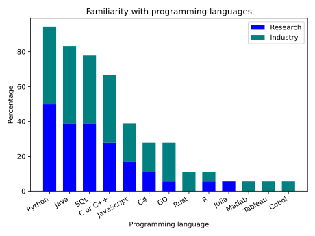

The majority of participants (94.4%) are familiar with Python, followed by Java (83.3%), SQL (77.8%), and C or C++ (66.7%). Distribution of familiarity with programming languages is similar between the Research and Industry groups.

### Question 4: How often do you require data discovery in your data analytics pipelines?
#### Single-Choice
- 1: Rarely
- 2
- 3
- 4
- 5: Very often

#### Results
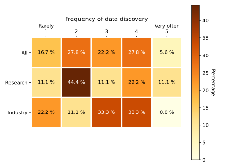

### Question 5: How do you solve your data discovery problems?
#### Multiple-Choice
- Asking other people or more senior employees where is the data.
- Writing SQL queries and use database metadata to understand the content.
- Manual work: writing scripts, visual inspection.
- Use some commercial tool to navigate the sources.
- Use some open source tool to navigate the sources.
- _Other (please specify)._

#### Results

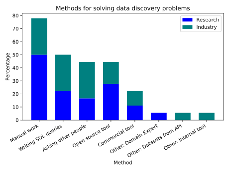

The majority of participants (77.8%) solve their data discovery problems manually, by writing scripts and visually inspecting the data. 50% of the participants use SQL queries to discover relevant datasets. The Research group relies more on manual work (100%) compared to the Industry group (55.6%). The Industry group uses SQL queries more often (55.6%) compared to the Research group (44.4%). Question 3 indicates that a popular scripting language among participants is Python, which could be used for manual work.

### Question 6: How often do you find the required dataset with a single search?
#### Single-Choice
- 1: Rarely
- 2
- 3
- 4
- 5: Very often
#### Results
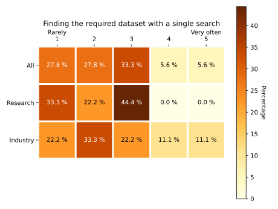

Most participants indicate, that it is more common for them to require multiple searches for finding a required dataset than finding it with a single search.

### Question 7: What kind of discovery result typically satisfies the downstream application?
#### Single-Choice
- A single table
- A composition of tables
- Both
#### Results
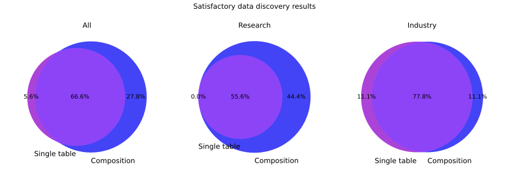

The majority of participants (66.6%) require both a single table and a composition of tables to satisfy the downstream application. The Research group prefers compositions of tables (44.4%) compared to the Industry group (11.1%). The Industry group prefers both a single table and a composition of tables (77.8%) compared to the Research group (55.6%).

### Question 8: Where does your data lake reside?
#### Multiple-Choice
- Databases
- File systems
#### Results
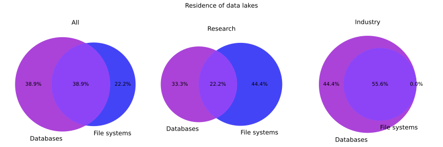

77.8% indicated that their data lakes are managed at least partly via traditional DBMS; 38.9% reported to only use DBMS. It is noteworthy that among industrial participants the preference to store the data lake in a DBMS was higher compared to academics.

### Question 9: Would you use databases if capabilities are provided, e.g., optimization, inverted index, and discovery operations?
#### Single-Choice
- Yes
- No
#### Results
All attendants unanimously expressed that they would use a DBMS if data discovery capabilities such as, indexes and optimizations are provided.
### Question 10: What kind of functionality or framework would support your discovery process?
#### Results (from free text input)

Participants provided a variety of answers to this question. Commonly mentioned features include indexing mechanisms, discovering joinable tables, and a user friendly interface.

### Question 11: Which of the following discovery task types are most similar to your data discovery needs?
#### Multiple-Choice
1.  Discover tables that contain a set of rows, e.g., <"Germany", "Berlin", "TXL">, <"France", "Paris", "CDG">
2.  Discover tables that are joinable with the "movie_title" column
3.  Discover tables that contain the following keywords: "Germany", "Bayern Munich", and "Manuel Neuer".
4.  Find tables that are not only joinable with "movie_title" but also contain the "director names" in a column.
5.  Find tables that contain a correlating column to the target column, that can benefit the downstream ML model.

#### Results
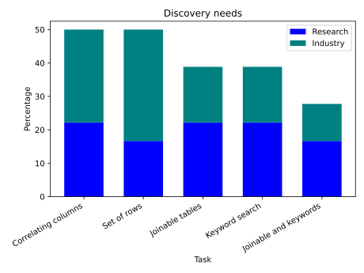

With regard to the prevalence of discovery task types, participants commonly selected complex tasks. The two most common tasks were discovering tables containing a set of rows and containing a correlating column to a target. According to our participant breakdown, these complex tasks are more prevalent in industry. Accordingly, those participants indicated more often that their discovery needs are met by table compositions in Question 7.

## Section 3: Implementation Preferences
We also surveyed the users about their preference for implementing simple and complex tasks. The simple task involves searching for keywords in tables, making sure they have a certain set of key words and not another. The complex task aims at finding tables that can be joined on two columns and also have columns correlating to a specified target. For this purpose, we provided them an implementation via SysX and alternatives. The simple task was presented using SysX’s API, native Python, and SQL, while the complex task could only be implemented using SysX’s API and Python.

### Question 12: Which implementation do you find favorable?
Consider a data discovery task that enables us to enrich the table at hand to increase the accuracy of the ML model in predicting the IMDB score of movies:

Task: Find tables that are not only joinable with "movie_title" but also contain the "director names" in a column. These tables should also contain a useful column, i.e., correlating column to the target column, that can benefit the downstream ML model.

Please examine the two following implementations of the task.
The first implementation leverages a library that provides a specific abstraction for data discovery operators. The second implementation leverages Python and Pandas dataframes to discover the desired tables.
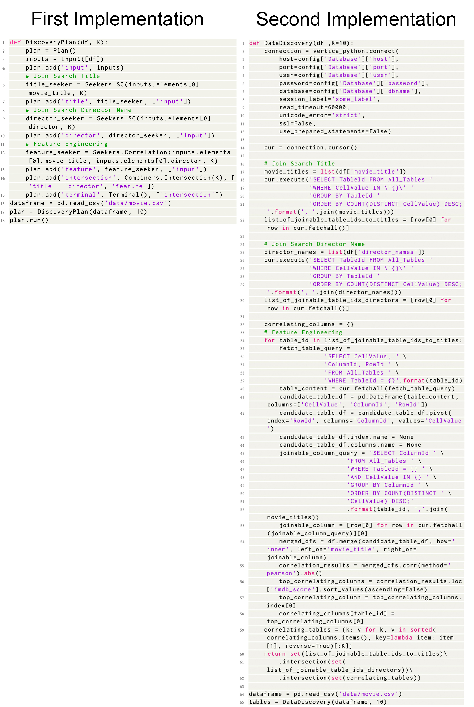
**Task implementations for Question 12.**

Which implementation do you find favorable?

#### Single-Choice
- First implementation
- Second implementation

#### Results
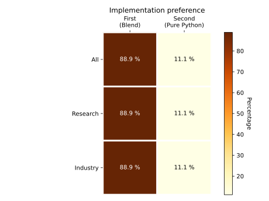

The results indicate that for both groups of participants the overwhelming majority favors the implementation of SysX over the native Python implementation.

### Question 13: Which implementation do you find favorable?
Consider the following data discovery task:

Task: Find tables that contain the following keywords <"Bayern Munich", "Eintracht Frankfurt", "FC Köln", and "Hertha Berlin"> but do not contain these keywords <"Barcelona", "Paris Saint Germain", "Arsenal", and "Juventus">.

Please examine the three following implementations of the task:

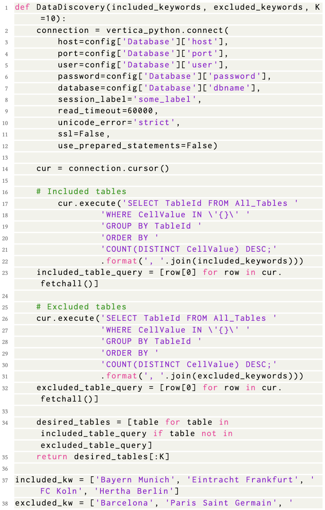
**First implementation for Question 13.**
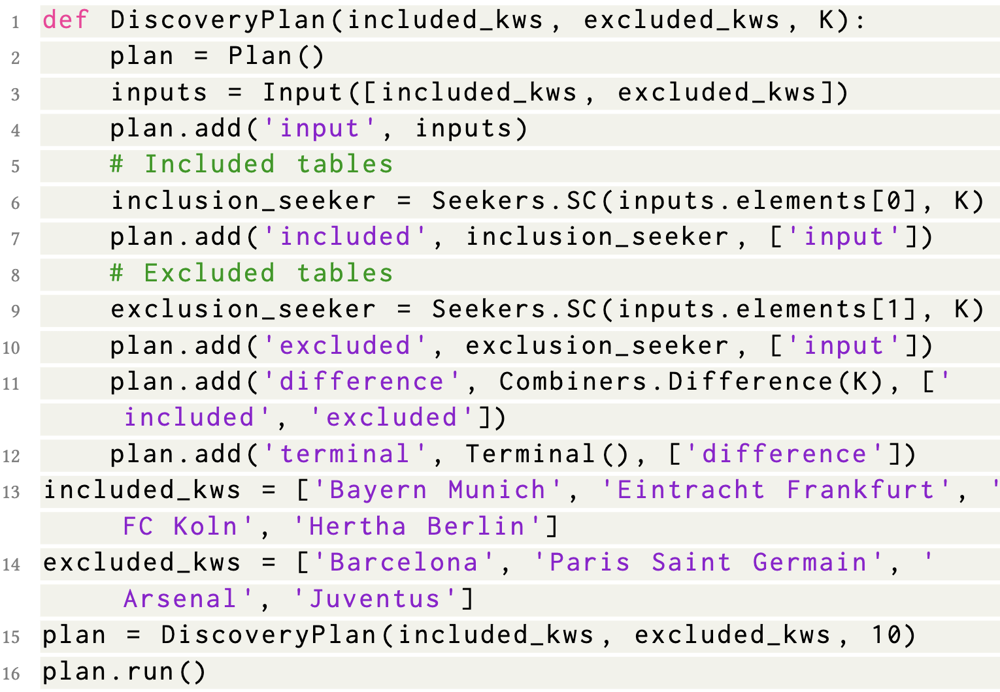
**Second implementation for Question 13.**
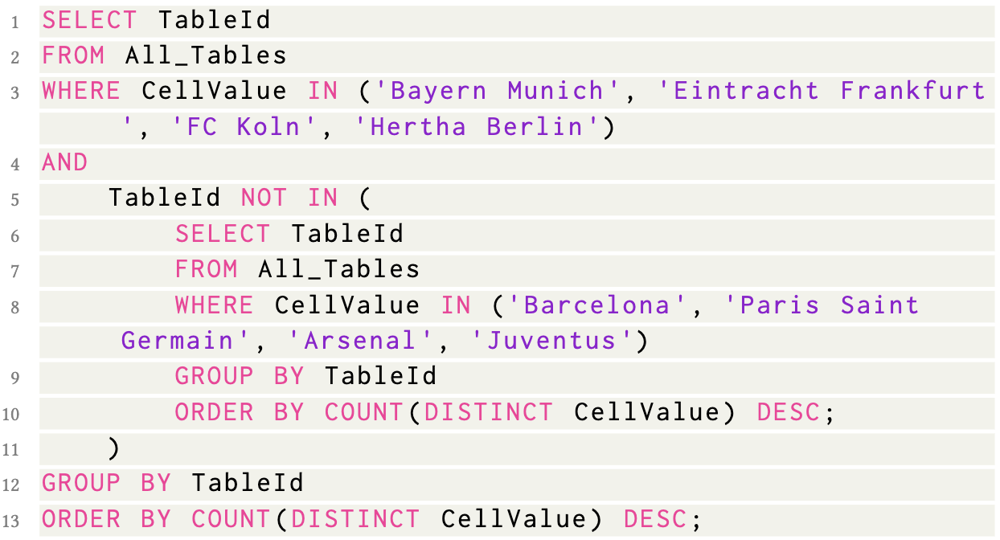
**Third implementation for Question 13.**

Which implementation do you find favorable?

#### Single-Choice
- First implementation
- Second implementation
- Third implementation

#### Results
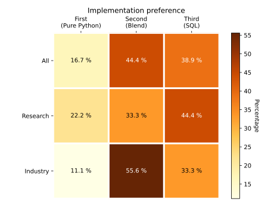

For the simple task, the majority (44.4%) favor SysX closely followed by SQL (38.9%). Only 16.7% favored the native python implementation.

## Summary
SysX enables users to construct custom data discovery plans through a single API, eliminating the need for multiple solutions. It provides a user-friendly interface to integrate various discovery solutions into a unified framework.
