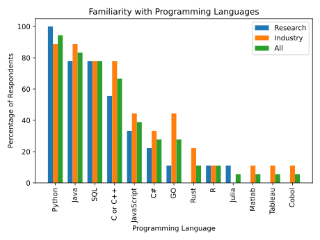
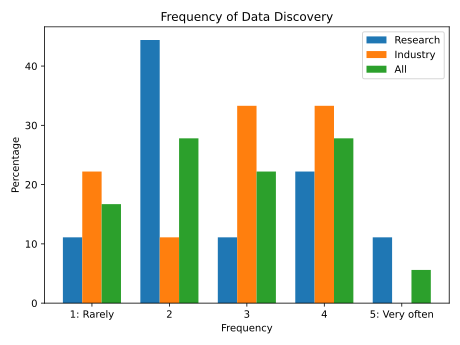

# User Study
We conducted a survey and obtained results from 18 participants (40% response rate) covering diverse sectors, such as health care, banking, technology, and universities. We aimed to understand preferences, needs, and challenges in data discovery and let participants choose between different implementations of simple and complex pipelines.

The questionaire was divided into two sections:
1. Background information on the participants
2. Questions on data discovery

Below we present the results of the survey, including the participants' roles, the industries they represent, their familiarity with programming languages, and their preferences for data discovery tools and methods.

## Section 1: Background Information
In order to gain insight into the participants' backgrounds and the potential influence of their roles and industries on their preferences and needs in data discovery, we asked them about their area of work and roles within their organizations.

### Question 1: What type of industry (education, finance, automotive, ...) do you belong to?
In order to group the participants according to their area of work, we asked them about their type of industry they belong to.
#### Results (from free text input)
| Answer                     | Count | Area of Work  |
|----------------------------|-------|---------------|
| Academia, applied projects | 1     | Research      |
| Education                  | 6     | Research      |
| Research                   | 2     | Research      |
| Automotive                 | 2     | Industry      |
| Finance                    | 3     | Industry      |
| Finance and business       | 1     | Industry      |
| Healthcare                 | 1     | Industry      |
| IoT                        | 1     | Industry      |
| Software industry          | 1     | Industry      |

Based on their answers we have grouped the 18 participants into two categories: Research and Industry. Research includes participants from academia, applied projects, and education. Industry includes participants from the automotive, finance, healthcare, IoT, and software industry.

### Question 2: What is your role in the organization?
To get better insights into the individual participants' we have asked them about their roles within their organizations.
#### Results (from free text input)
| Research | Industry |
|----------|----------|
| Senior Researcher | Head of Cloud Development |
| Research Associate | Software Developer |
| Research Associate | Developer |
| Researcher | Developer |
| Researcher | Data Scientist |
| Professor | Master Student |
| PhD Student | Data Science Trainee |
| PhD Student | Senior ML Engineer |
| PhD Student | Software Engineer |
| Research Assistant | Senior Engineer |

The Research group includes roles such as Senior Researcher, Research Associate, Researcher, Professor, PhD Student, and Research Assistant.

The Industry group includes roles such as Head of Cloud Development, Software Developer, Developer, Data Scientist, Master Student, Data Science Trainee, Senior ML Engineer, Software Engineer, and Senior Engineer.

## Section 2: Data Discovery
The second section of the questionnaire focused on getting insights into the participants' preferences and needs in data discovery.
### Question 3: What programming languages are you familiar with?
To start we asked the participants about the programming languages they are familiar with, to understand their technical background and how they approach data discovery tasks.
#### Muliple-Choice
- Python
- C or C++
- JavaScript
- Java
- SQL
- C#
- Rust
- GO
- _Other (please specify)_

#### Results

The majority of participants (94.4%) are familiar with Python, followed by Java (83.3%), SQL (77.8%), and C or C++ (66.7%). Distribution of familiarity with programming languages is similar between the Research and Industry groups.

### Question 4: How often do you require data discovery in your data analytics pipelines?
#### Single-Choice
- 1: Rarely
- 2
- 3
- 4
- 5: Very often

#### Results

### Question 5: How do you solve your data discovery problems?
#### Multiple-Choice
- Asking other people or more senior employees where is the data.
- Writing SQL queries and use database metadata to understand the content.
- Manual work: writing scripts, visual inspection.
- Use some commercial tool to navigate the sources.
- Use some open source tool to navigate the sources.
- _Other (please specify)._

#### Results
| Method                   | Research | Industry | All   |
|--------------------------|----------|----------|-------|
| Manual work              | 100.0%   | 55.6%    | 77.8% |
| Writing SQL queries      | 44.4%    | 55.6%    | 50.0% |
| Asking other people      | 33.3%    | 55.6%    | 44.4% |
| Open source tool         | 55.6%    | 33.3%    | 44.4% |
| Commercial tool          | 22.2%    | 22.2%    | 22.2% |
| Other: Domain Expert     | 11.1%    | 0.0%     | 5.6%  |
| Other: Datasets from API | 0.0%     | 11.1%    | 5.6%  |
| Other: Internal tool     | 0.0%     | 11.1%    | 5.6%  |

The majority of participants (77.8%) solve their data discovery problems manually, by writing scripts and visually inspecting the data. 50% of the participants use SQL queries to understand the content of the data. The Research group relies more on manual work (100%) compared to the Industry group (55.6%). The Industry group uses SQL queries more often (55.6%) compared to the Research group (44.4%).

### Question 6: How often do you find the required dataset with a single search?
#### Single-Choice
- 1: Rarely
- 2
- 3
- 4
- 5: Very often
#### Results
| Frequency | Research | Industry | All   |
|-----------|----------|----------|-------|
| 1         | 33.3%    | 22.2%    | 27.8% |
| 2         | 22.2%    | 33.3%    | 27.8% |
| 3         | 44.4%    | 22.2%    | 33.3% |
| 4         | 0.0%     | 11.1%    | 5.6%  |
| 5         | 0.0%     | 11.1%    | 5.6%  |
| Average   | 2.11     | 2.56     | 2.33  |
### Question 7: What kind of discovery result typically satisfies the downstream application?
#### Single-Choice
- A single table
- A composition of tables
- Both
#### Results
| Answer       | Research | Industry | All   |
|--------------|----------|----------|-------|
| Single table | 0.0%     | 11.1%    | 5.6%  |
| Composition  | 44.4%    | 11.1%    | 27.8% |
| Both         | 55.6%    | 77.8%    | 66.6% |

### Question 8: Where does your data lake reside?
#### Multiple-Choice
- Databases
- File systems
#### Results
| Location    | Research | Industry | All   |
|-------------|----------|----------|-------|
| Databases   | 33.3%    | 44.4%    | 38.9% |
| File systems| 44.4%    | 0.0%     | 22.2% |
| Both        | 22.2%    | 55.6%    | 38.9% |

### Question 9: Would you use databases if capabilities are provided, e.g., optimization, inverted index, and discovery operations?
#### Single-Choice
- Yes
- No
#### Results
| Answer | Research | Industry | All   |
|--------|----------|----------|-------|
| Yes    | 100.0%   | 100.0%   | 100.0%|
| No     | 0.0%     | 0.0%     | 0.0%  |
### Question 10: What kind of functionality or framework would support your discovery process?
#### Results (from free text input)

Semantic annotation of data resources and curated metadata for ease of further access; indexing mechanisms; visual inspection and profiling 

Fluent and simple data formatting, (pre-)processing and R/W pipeline

discoviering joinable tables

easy data imports from the browser

elastic search, kibana, simulation tools

Sklearn-style data discovery API

join discovery

Distribution-aware data discovery

A good index structure

None

User friendly Interface

raw, aggregated and visualized data at the same time

Description of tables, search over summerizations of tables

not sure yet

Simple Search and Access Process, Documentation

join, visualization, impact on downstream artifacts etc

not sure

Smart indexing 

### Question 11: Which of the following discovery task types are most similar to your data discovery needs?
#### Multiple-Choice
1.  Discover tables that contain a set of rows, e.g., <"Germany", "Berlin", "TXL">, <"France", "Paris", "CDG">
2.  Discover tables that are joinable with the "movie_title" column
3.  Discover tables that contain the following keywords: "Germany", "Bayern Munich", and "Manuel Neuer".
4.  Find tables that are not only joinable with "movie_title" but also contain the "director names" in a column.
5.  Find tables that contain a correlating column to the target column, that can benefit the downstream ML model.

#### Results
| Task | Research | Industry | All   |
|------|----------|----------|-------|
| 1    | 33.3%    | 66.7%    | 50.0% |
| 2    | 44.4%    | 33.3%    | 38.9% |
| 3    | 44.4%    | 33.3%    | 38.9% |
| 4    | 33.3%    | 22.2%    | 27.8% |
| 5    | 44.4%    | 55.6%    | 50.0% |

### Question 12: Which implementation do you find favorable?
Consider a data discovery task that enables us to enrich the table at hand to increase the accuracy of the ML model in predicting the IMDB score of movies:

Task: Find tables that are not only joinable with "movie_title" but also contain the "director names" in a column. These tables should also contain a useful column, i.e., correlating column to the target column, that can benefit the downstream ML model.

Please examine the two following implementations of the task.
The first implementation leverages a library that provides a specific abstraction for data discovery operators. The second implementation leverages Python and Pandas dataframes to discover the desired tables.
<figure>
    
    <figcaption style="text-align: center;"><strong>Figure 1: Task implementations for Question 12.</strong></figcaption>
</figure>
Which implementation do you find favorable?

#### Single-Choice
- First implementation
- Second implementation

#### Results
| Implementation | Research | Industry | All   |
|----------------|----------|----------|-------|
| First          | 88.9%    | 88.9%    | 88.9% |
| Second         | 11.1%    | 11.1%    | 11.1% |

### Question 13: Which implementation do you find favorable?
Consider the following data discovery task:

Task: Find tables that contain the following keywords <"Bayern Munich", "Eintracht Frankfurt", "FC Köln", and "Hertha Berlin"> but do not contain these keywords <"Barcelona", "Paris Saint Germain", "Arsenal", and "Juventus">.

Please examine the three following implementations of the task:

<figure>
    
    <figcaption style="text-align: center;"><strong>Figure 2: First implementation for Question 13.</strong></figcaption>
</figure>
<figure>
    
    <figcaption style="text-align: center;"><strong>Figure 3: Second implementation for Question 13.</strong></figcaption>
</figure>
<figure>
    
    <figcaption style="text-align: center;"><strong>Figure 4: Third implementation for Question 13.</strong></figcaption>
</figure>

Which implementation do you find favorable?

#### Single-Choice
- First implementation
- Second implementation
- Third implementation

#### Results
| Implementation | Research | Industry | All   |
|----------------|----------|----------|-------|
| First          | 22.2%    | 11.1%    | 16.7% |
| Second         | 33.3%    | 55.6%    | 44.4% |
| Third          | 44.4%    | 33.3%    | 38.9% |

With regard to the prevalence of discovery task types, participants commonly selected complex tasks. The two most common tasks were discovering tables containing a set of rows and contain
ing a correlating column to a target. According to our participant breakdown, these complex tasks are more prevalent in industry. Accordingly, those participants indicated more often that their dis
covery needs are met by table compositions. 78% of the participants solve these complex problems by writing custom scripts from scratch, with 94.4% using Python for this pur
pose. Also, 78% indicated that their data lakes are managed at least partly via traditional DBMS; 39% reported to only use DBMS. It is noteworthy that among industrial participants the preference to store the data lake in a DBMS was higher compared to academics. Regardless, all attendants unanimously expressed that they would use a DBMS if data discovery capabilities such as, indexes and optimizations are provided. Wealsosurveyed the users about their preference for implement
ing simple and complex tasks. The simple task involves searching for keywords in tables, making sure they have a certain set of key
words and not another. The complex task aims at finding tables that can be joined on two columns and also have columns corre
lating to a specified target. For this purpose, we provided them an implementation via SysX and alternatives. The simple task was presented using SysX’s API, native Python, and SQL, while the complex task could only be implemented using SysX’s API and Python. For the simple task, the majority (44.4%) favor SysX closely followed by SQL (38.9%). Only 16,7% favored the native python implementation. For the complex task, this gap is even bigger as the Python implementation becomes significantly more complicated. Participants justify their choice by mentioning that SysX’s API is more flexible, concise, easy-to-understand, and robust w.r.t. errors. Summary. SysX enables users to construct custom data discov
ery plans through a single API, eliminating the need for multiple solutions. It provides a user-friendly interface to integrate various discovery solutions into a unified framework. Experiments show that SysX achieves similar to or better performance than individu
ally optimized counterparts, utilizing the database 45% more than baselines on average. This efficiency is because SysX moves 83.5% of discovery computations into the database, reducing data loading time by 54.5% for certain operations compared to alternatives such as MATE. For more details, we refer to the results on our GitHub.
