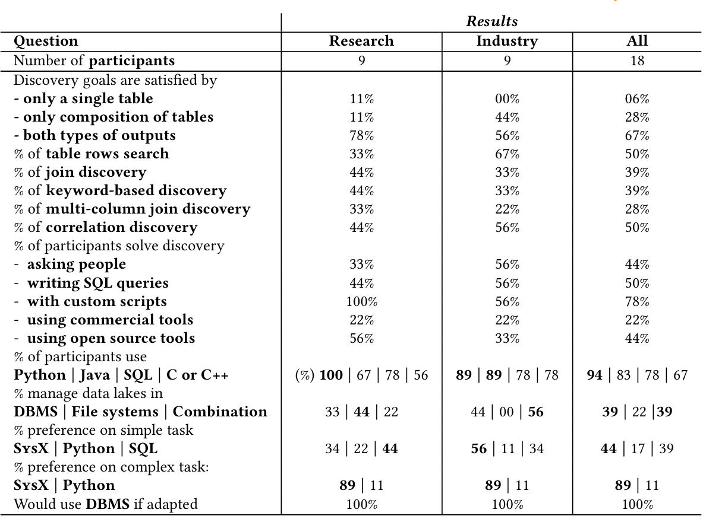

# User Study
We conducted a survey and obtained results from 18 participants (40% responserate) covering diverse sectors,such as health care, banking, technology, and universities.We aimed tounderstand preferences, needs, and challenges in data discovery and let participants choose between different implementations of simple and complex pipelines.

<figure>
    
    <figcaption style="text-align: center;"><strong>Table 1: User Study Summary.</strong></figcaption>
</figure>

Table 1 illustrates the summarized statistics of the study and breaks down the results based on the participant affiliation:

Research indicates those involved in academia,and Industry are individuals employed in companies. Below we present the individual questions and the results as well as a discussion for each question.

## Section 1: Intro
### Survey on pipelining data discovery
In this survey, we want to study the preferences of ML and data practitioners that rely on data discovery.

Data privacy policy: 
To ensure compliance with the EU General Data Protection Regulation (GDPR), we want to clarify our data collection practices. We do not collect any personal information, and it is imperative that you refrain from providing sensitive details. Our data collection is restricted to gathering information about the type of organization you represent and your role within it. This information is used solely for the purpose of categorizing participants and facilitating group analysis. It is crucial to emphasize that only aggregated and anonymized results of the questionnaire will be published, guaranteeing the confidentiality and privacy of individual responses.

## Section 2: Participant's info
Please answer to the following questions.
### Question 1: Type of industry (education, finance, automotive, ...)

### Question 2: Your role in the organization

## Section 3: Data Discovery
Dear Participants,

Thank you for taking the time to participate in our survey on data discovery. In the following, we first give some background context on the terminology we will use in the survey.

**What is Data Discovery from a Data Lake?**

Data discovery involves the process of locating and extracting relevant information from large and complex data lakes. A data lake is a vast repository that holds raw data, providing a centralized storage solution. Imagine it as an expansive reservoir of information waiting to be explored and utilized.

**Examples of Data Discovery Scenarios:**

1. **Machine Learning Tasks:** Suppose you are working on a machine learning task, but the required information is not readily available in your dataset. In such cases, effective data discovery becomes crucial to identify and retrieve the necessary features and patterns to enhance the performance of your models. Consider a machine learning project aiming to predict house prices. The dataset lacks crucial information such as house size and location. To address this, data discovery is essential. You might need to explore external sources to find missing details like square footage, neighborhood information, and additional features.

2. **University Projects:** Consider a scenario where you have a university project, but the datasets required for your analysis are not readily accessible. You might need to explore public sources to find relevant datasets that align with the objectives of your project. Imagine the project of Analyzing smartphone market trends and consumer behavior to provide insights on factors influencing purchasing decisions. One should utilize datasets sourced from government data, market sales info, and industry publications. 

## Section 4: Survey questions Part 1
### Question 3: What programming languages are you familiar with?
Choose all that apply:
- Python
- C or C++
- JavaScript
- Java
- SQL
- C#
- Rust
- GO
- _Other (please specify)_

#### Results
| Language   | Research | Industry | All   |
|------------|----------|----------|-------|
| Python     | 100%     | 88.9%    | 94.4% |
| Java       | 77.8%    | 88.9%    | 83.3% |
| SQL        | 77.8%    | 77.8%    | 77.8% |
| C or C++   | 55.6%    | 77.8%    | 66.7% |
| JavaScript | 33.3%    | 44.4%    | 38.9% |
| C#         | 22.2%    | 33.3%    | 27.8% |
| GO         | 11.1%    | 44.4%    | 27.8% |
| Rust       | 0.0%     | 22.2%    | 11.1% |
| R          | 11.1%    | 11.1%    | 11.1% |
| Julia      | 11.1%    | 0.0%     | 5.6%  |
| Matlab     | 0.0%     | 11.1%    | 5.6%  |
| Tableau    | 0.0%     | 11.1%    | 5.6%  |
| Cobol      | 0.0%     | 11.1%    | 5.6%  |

**Table 2: Familiarity with Programming Languages**

The majority of participants (94.4%) are familiar with Python, followed by Java (83.3%), SQL (77.8%), and C or C++ (66.7%).

### Question 4: How often do you require data discovery in your data analytics pipelines?
Choose one of the following:
- 1: Rarely
- 2
- 3
- 4
- 5: Very often

#### Results
| Frequency | Research | Industry | All   |
|-----------|----------|----------|-------|
| 1         | 11.1%    | 22.2%    | 16.7% |
| 2         | 44.4%    | 11.1%    | 27.8% |
| 3         | 11.1%    | 33.3%    | 22.2% |
| 4         | 22.2%    | 33.3%    | 27.8% |
| 5         | 11.1%    | 0.0%     | 5.6%  |
| Average   | 2.78     | 2.78     | 2.78  |

### Question 5: How do you solve your data discovery problems?
Manual work: writing scripts, visual inspection: 100.0%
Use some open source tool to navigate the sources: 55.6%
Writing SQL queries and use database metadata to understand the content: 44.4%
Asking other people or more senior employees where is the data: 33.3%
Use some commercial tool to navigate the sources: 22.2%
Domain experts of the data provider: 11.1%

Choose all that apply:
- Asking other people or more senior employees where is the data.
- Writing SQL queries and use database metadata to understand the content.
- Manual work: writing scripts, visual inspection.
- Use some commercial tool to navigate the sources.
- Use some open source tool to navigate the sources.
- _Other (please specify)._

#### Results
| Method                   | Research | Industry | All   |
|--------------------------|----------|----------|-------|
| Manual work              | 100.0%   | 55.6%    | 77.8% |
| Writing SQL queries      | 44.4%    | 55.6%    | 50.0% |
| Asking other people      | 33.3%    | 55.6%    | 44.4% |
| Open source tool         | 55.6%    | 33.3%    | 44.4% |
| Commercial tool          | 22.2%    | 22.2%    | 22.2% |
| Other: Domain Expert     | 11.1%    | 0.0%     | 5.6%  |
| Other: Datasets from API | 0.0%     | 11.1%    | 5.6%  |
| Other: Internal tool     | 0.0%     | 11.1%    | 5.6%  |

### Question 6: How often do you find the required dataset with a single search?
Choose one of the following:
- 1: Rarely
- 2
- 3
- 4
- 5: Very often
### Question 7: What kind of discovery result typically satisfies the downstream application?
Choose one of the following:
- A single table
- A composition of tables
- Both
### Question 8: Where does your data lake reside?
Choose all that apply:
- Databases
- File systems
### Question 9: Would you use databases if capabilities are provided, e.g., optimization, inverted index, and discovery operations?
Choose one of the following:
- Yes
- No
### Question 10: What kind of functionality or framework would support your discovery process?
Free text input.
### Question 11: Which of the following discovery task types are most similar to your data discovery needs?
Choose all that apply:
- Discover tables that contain a set of rows, e.g., <"Germany", "Berlin", "TXL">, <"France", "Paris", "CDG">
- Discover tables that are joinable with the "movie_title" column
- Discover tables that contain the following keywords: "Germany", "Bayern Munich", and "Manuel Neuer".
- Find tables that are not only joinable with "movie_title" but also contain the "director names" in a column.
- Find tables that contain a correlating column to the target column, that can benefit the downstream ML model.

### Question 12.1: Which implementation do you find favorable?
Consider a data discovery task that enables us to enrich the table at hand to increase the accuracy of the ML model in predicting the IMDB score of movies:

Task: Find tables that are not only joinable with "movie_title" but also contain the "director names" in a column. These tables should also contain a useful column, i.e., correlating column to the target column, that can benefit the downstream ML model.

Please examine the two following implementations of the task.
The first implementation leverages a library that provides a specific abstraction for data discovery operators. The second implementation leverages Python and Pandas dataframes to discover the desired tables.
<figure>
    
    <figcaption style="text-align: center;"><strong>Figure 1: Task implementations for Question 12.</strong></figcaption>
</figure>
Which implementation do you find favorable? Choose one of the following:

- Implementation 1
- Implementation 2

### Question 12.2: Why?
Free text input.
### Question 13.1: Which implementation do you find favorable?
Consider the following data discovery task:

Task: Find tables that contain the following keywords <"Bayern Munich", "Eintracht Frankfurt", "FC Köln", and "Hertha Berlin"> but do not contain these keywords <"Barcelona", "Paris Saint Germain", "Arsenal", and "Juventus">.

Please examine the three following implementations of the task:

<figure>
    
    <figcaption style="text-align: center;"><strong>Figure 2: Task implementation 1 for Question 13.</strong></figcaption>
</figure>
<figure>
    
    <figcaption style="text-align: center;"><strong>Figure 3: Task implementation 2 for Question 13.</strong></figcaption>
</figure>
<figure>
    
    <figcaption style="text-align: center;"><strong>Figure 4: Task implementation 3 for Question 13.</strong></figcaption>
</figure>

Which implementation do you find favorable? Choose one of the following:
- Implementation 1
- Implementation 2
- Implementation 3

### Question 13.2: Why?
Free text input.

With regard to the prevalence of discovery task types, participants commonly selected complex tasks. The two most common tasks were discovering tables containing a set of rows and contain
ing a correlating column to a target. According to our participant breakdown, these complex tasks are more prevalent in industry. Accordingly, those participants indicated more often that their dis
covery needs are met by table compositions. 78% of the participants solve these complex problems by writing custom scripts from scratch, with 94.4% using Python for this pur
pose. Also, 78% indicated that their data lakes are managed at least partly via traditional DBMS; 39% reported to only use DBMS. It is noteworthy that among industrial participants the preference to store the data lake in a DBMS was higher compared to academics. Regardless, all attendants unanimously expressed that they would use a DBMS if data discovery capabilities such as, indexes and optimizations are provided. Wealsosurveyed the users about their preference for implement
ing simple and complex tasks. The simple task involves searching for keywords in tables, making sure they have a certain set of key
words and not another. The complex task aims at finding tables that can be joined on two columns and also have columns corre
lating to a specified target. For this purpose, we provided them an implementation via SysX and alternatives. The simple task was presented using SysX’s API, native Python, and SQL, while the complex task could only be implemented using SysX’s API and Python. For the simple task, the majority (44.4%) favor SysX closely followed by SQL (38.9%). Only 16,7% favored the native python implementation. For the complex task, this gap is even bigger as the Python implementation becomes significantly more complicated. Participants justify their choice by mentioning that SysX’s API is more flexible, concise, easy-to-understand, and robust w.r.t. errors. Summary. SysX enables users to construct custom data discov
ery plans through a single API, eliminating the need for multiple solutions. It provides a user-friendly interface to integrate various discovery solutions into a unified framework. Experiments show that SysX achieves similar to or better performance than individu
ally optimized counterparts, utilizing the database 45% more than baselines on average. This efficiency is because SysX moves 83.5% of discovery computations into the database, reducing data loading time by 54.5% for certain operations compared to alternatives such as MATE. For more details, we refer to the results on our GitHub.
